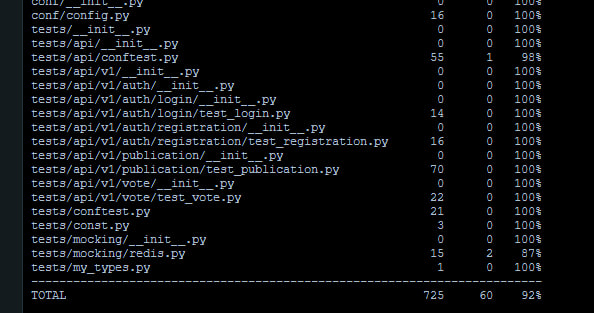
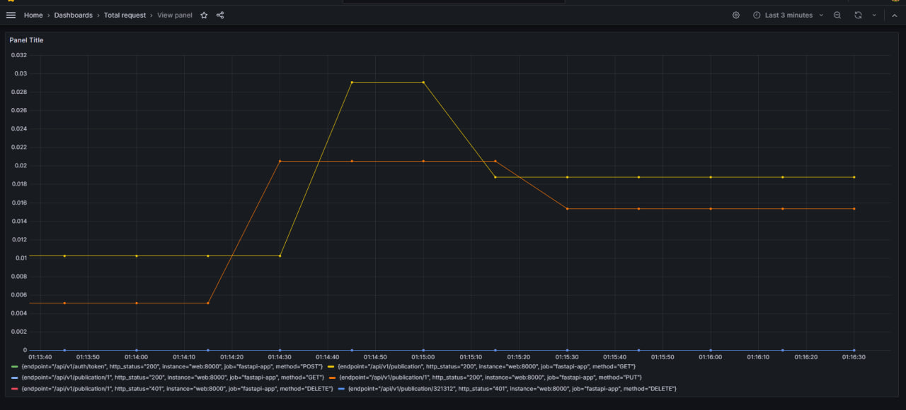

# О проекте

FastAPi приложение с воможность:
- зарегистрироваться 
- создавать публикацию
- оценить публикацию

# Stack
- `Python 3.11` + `FastAPI 0.108.0` - backend
- `PostgreSQL` - основная база данных
- `sqlalchemy 2.0` - ORM для работы с бд
- `redis` - для кеширование и улучшение производительности
- `prometheus` - для сбора метрик
- `grafana` - для визулизации метрик
- `flake8`, `mypy` -  code style, linter
- `pytest` - тестирование

# Start
Create `.env` file in `/conf` from `.env.example`.

### Create network

`docker network create -d bridge publication-network`

### Start up

`docker compose up`

### go to http://localhost:8000/docs

# Pytest 
Покрытие тестами составляет 92%

# Grafana
Пример метрик

